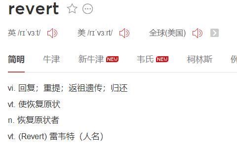

# 将错误代码提交到远程后的解决方式

> 在我们日常开发中，会遇到将错误代码合并到主分支并且提交到远程后，过了一段时间的开发，无论是测试还是开发人员发现了错误，但是此时主分支中在错误节点后已经存在正确的代码。下面给出三种解决这种场景的git命令

## git revert

首先来看下单词revert与reset的翻译结果

提起 `git revert` 就不能不提 `git reset`，按照上面的翻译结果来说，两者都可以做代码回退，并且平时我们常用的是git reset这个命令而不是git revert，如果用一句话来解释二者的区别：revert 是回滚某个 commit ，不是回滚“到”某个

二者详细的区别可以查看：[git reset 与git revert的区别](https://blog.csdn.net/yxlshk/article/details/79944535)  当理解了二者的区别后，回到文章开头的那个问题上，我们可以使用git revert命令反做掉有问题的那次提交，然后剩下正确的提交仍然存在，这种方式也是解决这类情况最快最简单的处理方式。

## git cherry-pick

见需求。这时分两种情况。一种情况是，你需要另一个分支的所有代码变动，那么就采用合并（git merge）。另一种情况是，你只需要部分代码变动（某几个提交），这时可以采用 Cherry pick。关于此命令的详细介绍可以查看：[git cherry-pick 教程](https://www.ruanyifeng.com/blog/2020/04/git-cherry-pick.html)

如果回到文章最上面提出的场景，我们的处理方式就是首先回退代码，然后使用cherry-pick将需要的提交内容拉回到当前分支。

## git chekout 

git checkout 其实跟提交回滚、反做等并没有直接的关系，通常情况下我们使用此命令做分支切换，如果我们只想要某个分支下确定路径的代码，而不需要将其他部分代码，我们可以使用git checkout 命令，例如：

当前我们在 `development` 分支上，我们想要 `adjustTree` 分支下的某个确定路径的代码到 `development` 分支，就可以使用 `git checkout` 命令来达到目的。具体说明可以查看这篇文档：Git 合并指定文件或文件夹

:::tip
综上所述：`git revert` 是最适合将错误代码剔除的方案，其余两个命令是针对特定情况下的处理方式
:::