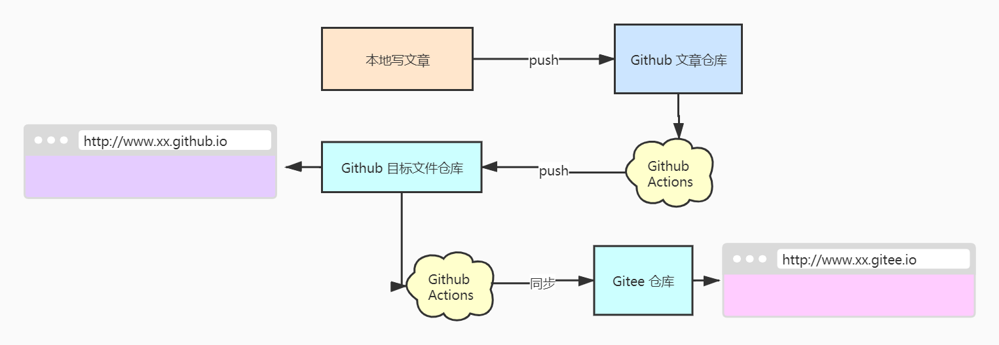

# 如何打造一个静态博客


本篇文章主要是介绍如何搭建一个免费的个人或团队博客:tada:。

### 起因

团队长期在内部系统中写技术文章，只能内部访问，辐射范围太小，写作和阅读体验差。

### 好处

- 提升团队在业界的品牌和影响力
- 有利于吸引求职者

### 目标

我们要实现的最终效果是：

- 不花一分钱
- 外网可**快速**访问
- 更好的写作体验
- 自动化部署

## 写作

好的写作体验是什么？Vscode之类的本地编辑器肯定是首选的工具，纯粹的写作就应该是纯文本的，因此Markdown也自然成了最佳的格式。

### CMS选择

选择 `vuepress` 的原因是因为它

- 基于我们熟悉的Vue
- 可插入Vue组件
- 支持本地 Markdown 纯写作
- 支持本地预览和热加载
- 支持丰富的插件和定制

当然也有其它类似的，可以查看[官网的对比](https://vuepress.vuejs.org/zh/guide/#%E4%B8%BA%E4%BB%80%E4%B9%88%E4%B8%8D%E6%98%AF)

### Markdown

VuePress 使用 [markdown-it](https://markdown-it.github.io/) 来渲染 Markdown

- [Vuepress Markdown扩展](https://vuepress.vuejs.org/zh/guide/markdown.html)

## 部署

完成写作之后，可以执行 `npm run build` 来将其构建成可以在浏览器中运行的目标文件。

### 服务空间选择

生成的 `dist` 目录需要部署到服务器上面绑上域名才可以在外网浏览，所以我们需要选择一个服务器，那么通常的服务器是需要收费的。

但穷，穷则生变，会引发我们思考，有没有免费的服务器可以用来部署呢？当然有，Github本身就提供了静态页面托管的功能[GitHub Pages](https://pages.github.com/)，我们只需要把生成的 `dist` push 到指定的仓库即可在线上浏览，详细步骤就不说了。

### CI持续集成

每次写完都要手动 build 显然是不够人性化的，能不能写完就直接 push 就能自动帮我们 build 然后部署呢？这就是 CI 的作用了，当然 CI 也有很多，那么 Github 也提供了，名为 Github Acitons，用法可参考[阮一峰的 GitHub Actions 入门教程](http://www.ruanyifeng.com/blog/2019/09/getting-started-with-github-actions.html)

新建两个仓库，一个用来存放文章的源码，另外一个用来存放构建之后的目标文件用来运行。

要使用 Github Actions，只需要新建一个部署文件 `.github/workfkows/xxx.yml` 即可，内容如下

```yml {5}
name: Build and Deploy
on: [push]
jobs:
  build-and-deploy:
    runs-on: ubuntu-latest
    steps:
    - name: Checkout
      uses: actions/checkout@master

    - name: vuepress-deploy
      uses: jenkey2011/vuepress-deploy@master
      env:
        ACCESS_TOKEN: ${{ secrets.ACCESS_TOKEN }}
        TARGET_REPO: CDTRSFE/cdtrsfe.github.io
        TARGET_BRANCH: master
        BUILD_SCRIPT: npm install && npm run build
        BUILD_DIR: blogs/.vuepress/dist/
```


### 国内加速

主要工作完成了，但是众所周知，Github Page 的访问速度比较慢，我又陷入了沉思，如何让他快起来呢？我悟到了，没错，就是镜像。

因为国内也有很多Git服务（如Coding、Gitee...）经过测试，Gitee支持和Github一样的静态网站托管服务，于是我选择了它。


所以整个流程就变成了：



